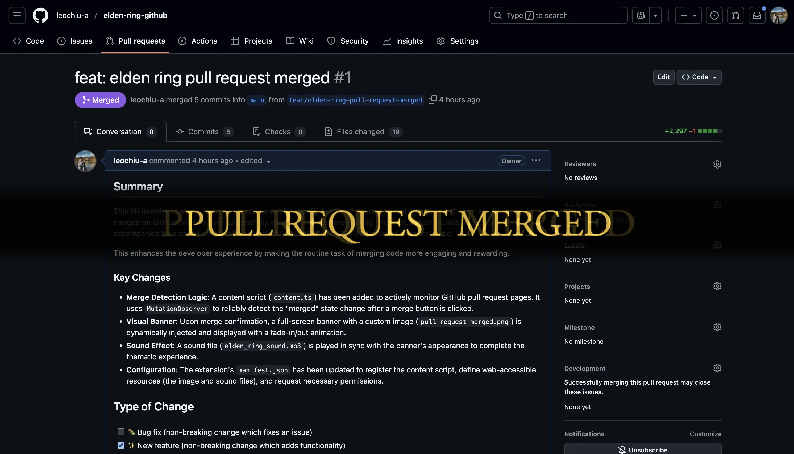

# Elden Ring GitHub 🏆

A Chrome extension that displays epic Elden Ring-themed banners when you create or merge pull requests on GitHub. Transform your development milestones into legendary moments!

👉 [Elden Ring GitHub (Chrome Web Store)](https://chromewebstore.google.com/detail/elden-ring-github/dfhmjflkbjjmlapbghecjfhnnmehcbke?authuser=1&hl=en)

## ✨ Features

- 🆕 **PR Creation Banner** - Celebrate new pull request creation with a dedicated banner
- 🎉 **PR Merge Banner** - Shows an epic "MERGE ACCOMPLISHED" banner when PRs are merged
- 🔊 **Sound Effects** - Plays the iconic Elden Ring achievement sound
- ⚙️ **Independent Controls** - Separate settings to enable/disable creation and merge banners



## 🚀 Quick Start

### Installation

1. **Build the extension**:

   ```bash
   pnpm install
   pnpm run build
   ```

2. **Load in Chrome**:
   - Open `chrome://extensions/`
   - Enable "Developer mode" (top right toggle)
   - Click "Load unpacked"
   - Select the `dist/` folder

3. **Start creating and merging**:
   - Navigate to any GitHub repository
   - Create or merge pull requests and enjoy epic celebrations! 🎉

## 🎮 Usage

### Automatic Mode

**For PR Creation:**

1. Navigate to any GitHub repository
2. Go to the "Compare" page (e.g., from comparing branches)
3. Click "Create pull request" button
4. Watch your PR creation celebrated with an epic banner! ✨

**For PR Merging:**

1. Visit any GitHub pull request page
2. Click "Merge pull request" → "Confirm merge"
3. Watch as your merge is celebrated with epic fanfare! 🎉

### Test Mode

1. Click the extension icon in your Chrome toolbar
2. Press "Test Banner" to preview the effect
3. Configure settings to your liking

## ⚙️ Configuration

Access settings by clicking the extension icon:

- **🎉 Show on PR merged**: Toggle banner display when PRs are merged
- **🆕 Show on PR creation**: Toggle banner display when PRs are created
- **🔊 Play sound effect**: Toggle the iconic Elden Ring achievement sound
- **⏱️ Banner Duration**: Choose how long celebrations last (3-10 seconds)
- **📊 Page Status**: See if you're currently on a GitHub page
- **🧪 Test Banner**: Preview the banner effect anytime

## 🛠️ Development

### Tech Stack

- **TypeScript** - Type-safe development with modern ES features
- **tsdown** - Lightning-fast TypeScript bundler
- **oxlint** - Super-fast linting for code quality

### Project Structure

```
src/
├── content/              # Content script (GitHub integration)
│   ├── content.ts       # PR creation & merge detection logic
│   └── styles.css       # Banner styling
├── popup/               # Extension popup interface
│   ├── popup.ts        # Settings and test functionality
│   ├── popup.html      # Popup UI structure
│   └── popup.css       # Popup styling
├── types/              # TypeScript type definitions
│   ├── settings.ts     # Settings interface
│   └── global.d.ts     # Global type declarations
└── assets/             # Static resources
    ├── elden_ring_sound.mp3
    ├── pull-request-created.png    # PR creation banner
    ├── pull-request-merged.png     # PR merge banner
    └── icon*.png        # Extension icons

dist/                   # Built extension (Chrome loads this)
├── manifest.json
├── content/
├── popup/
└── assets/
```
